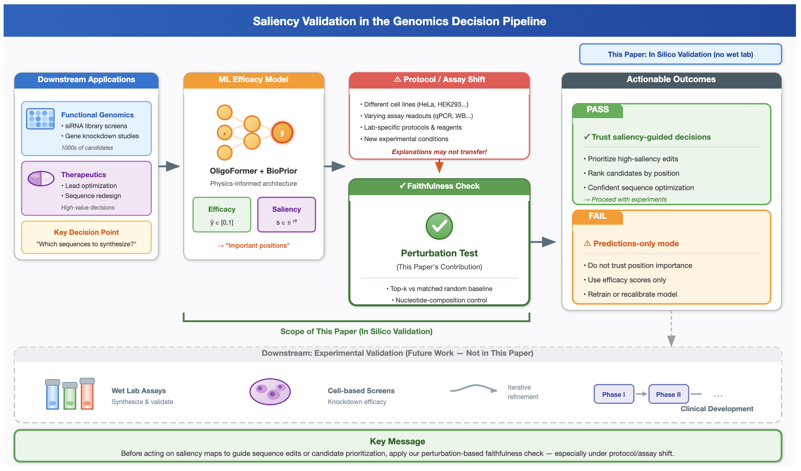
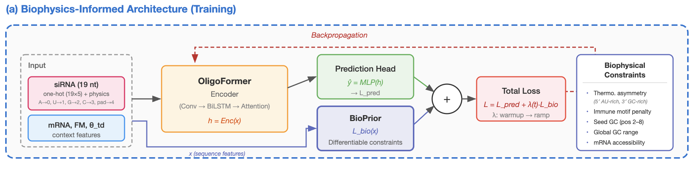
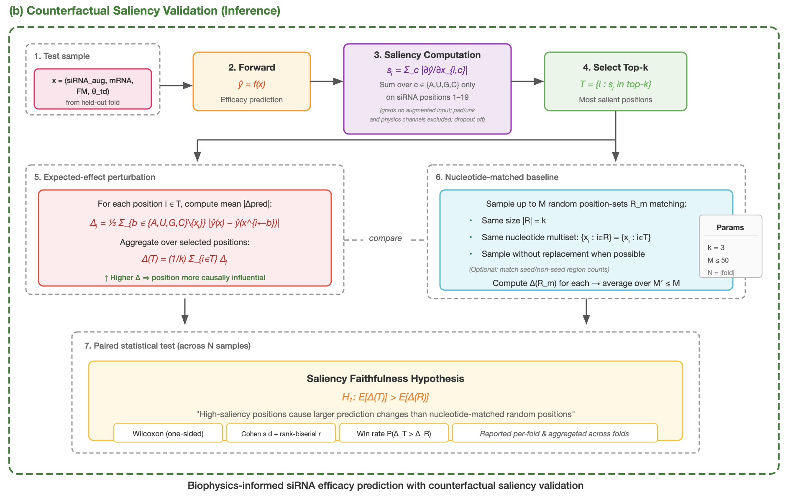
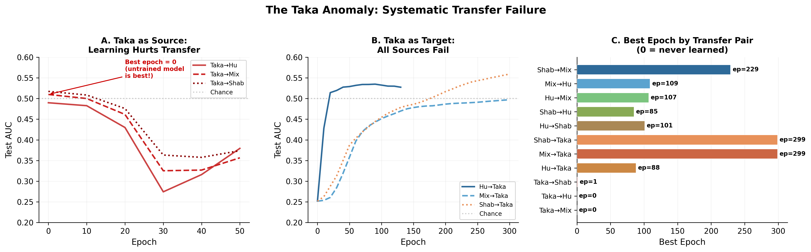

# BioPrior

[](https://www.python.org/)
[](https://pytorch.org/)

**Validating Interpretability in siRNA Efficacy Prediction: A Perturbation-Based, Dataset-Aware Protocol**

BioPrior extends [OligoFormer](https://github.com/lulab/OligoFormer) with biology-informed regularization and a perturbation-based saliency validation protocol for siRNA efficacy prediction. We introduce a **pre-synthesis gate** that tests whether gradient-based saliency maps faithfully identify model-sensitive positions before they are used to guide sequence design decisions.

📄 **Paper:** [arXiv (coming soon)]()
👥 **Authors:** Zahra Khodagholi, Niloofar Yousefi — University of Central Florida


*Positioning saliency validation in the lab-in-the-loop decision pipeline. Our protocol acts as a pre-synthesis gate before saliency maps are used for design guidance.*

## Key Contributions

1. **Saliency validation protocol** — A composition-controlled, perturbation-based faithfulness test with nucleotide-matched baselines and pass/fail criteria for deploy-time decisions.
2. **Cross-dataset faithfulness analysis** — 19/20 fold–dataset settings pass; cross-dataset transfer reveals two failure modes (*faithful-but-wrong* and *inverted saliency*) that would otherwise go undetected.
3. **Biology-informed regularization (BioPrior)** — Differentiable constraints encoding thermodynamic asymmetry, seed region composition, GC heuristics, and immune motif avoidance.
4. **Protocol-level diagnostic** — Taka (luciferase reporter) exhibits systematic incompatibility with mRNA-level assay datasets, demonstrating that assay shifts can silently invalidate explanations.



*Top: Training with BioPrior constraints. Bottom: Saliency validation via expected-effect perturbations with nucleotide-matched baselines.*

## Datasets

We evaluate on four benchmark groups spanning distinct experimental protocols and cell lines:

| Dataset | siRNA Number | Cell Line | Group |
|---------|-------------|-----------|-------|
| [Huesken](https://www.nature.com/articles/nbt1118) | 2,431 | H1299 | **Hu** |
| [Reynolds](https://www.nature.com/articles/nbt936) | 240 | HEK293 | Mix |
| [Vickers](https://www.jbc.org/article/S0021-9258(19)32641-9/fulltext) | 76 | T24 | Mix |
| [Harborth](https://www.liebertpub.com/doi/10.1089/108729003321629638) | 44 | HeLa | Mix |
| [Ui-Tei](https://academic.oup.com/nar/article/32/3/936/2904484) | 62 | HeLa | Mix |
| [Khvorova](https://www.nature.com/articles/nbt936) | 14 | HEK293 | Mix |
| [Hsieh](https://academic.oup.com/nar/article/32/3/893/2904476) | 108 | HEK293T | Mix |
| [Amarzguioui](https://pubmed.ncbi.nlm.nih.gov/12527766/) | 46 | Cos-1, HaCaT | Mix |
| [Takayuki](https://academic.oup.com/nar/article/35/4/e27/1079934) | 702 | HeLa | **Taka** |
| [Shabalina](https://pubmed.ncbi.nlm.nih.gov/16357112/) | 653 | Multiple | **Shabalina** |

Following [OligoFormer](https://github.com/lulab/OligoFormer), we organize datasets into four groups: **Hu** (Huesken), **Mix** (7 studies, 581 siRNAs after deduplication), **Taka** (Takayuki), and **Shabalina**. Cross-dataset transfer experiments reveal that Taka (luciferase reporter assay, single target) is systematically incompatible with the other three groups.

## Installation

### Requirements

- Python 3.8+
- PyTorch 1.12+
- CUDA 11.3+ (NVIDIA GPU with ~8GB memory)
- ViennaRNA (for thermodynamic features)

### Setup

```bash
# Clone repository
git clone https://github.com/shadi97kh/BioPrior.git
cd BioPrior

# Create environment
conda create -n bioprior python=3.8
conda activate bioprior

# Install PyTorch (adjust CUDA version as needed)
conda install pytorch==1.12.0 torchvision torchaudio cudatoolkit=11.3 -c pytorch

# Install dependencies
pip install -r requirements.txt

# Install ViennaRNA for thermodynamic calculations
conda install -c bioconda viennarna
```

### RNA-FM Embeddings

RNA-FM embeddings are required for sequence representation:

```bash
# Option 1: Download pre-packaged RNA-FM
wget https://cloud.tsinghua.edu.cn/f/46d71884ee8848b3a958/?dl=1 -O RNA-FM.tar.gz
tar -zxvf RNA-FM.tar.gz

# Option 2: Clone and set up RNA-FM from source
git clone https://github.com/ml4bio/RNA-FM.git
cd RNA-FM
conda env create --name RNA-FM -f environment.yml
conda activate RNA-FM
```

Download pre-trained RNA-FM weights from [this gdrive link](https://drive.google.com/drive/folders/1VGye74GnNXbUMKx6QYYectZrY7G2pQ_J?usp=share_link) and place `.pth` files into the `pretrained` folder.

```bash
# Generate RNA-FM features for all datasets
conda activate RNA-FM
bash scripts/RNA-FM-features.sh
conda activate bioprior
```

### Verify Installation

```bash
# Quick test — should print model summary and exit
python scripts/main.py --datasets Hu --epoch 1 --cuda 0
```

## Usage

### Intra-Dataset Evaluation (5-fold CV)

Train and evaluate with BioPrior on individual datasets:

```bash
# Huesken dataset
python scripts/main.py --datasets Hu --val_mode intra --epoch 300 --early_stopping 50 --cuda 0

# Takayuki dataset
python scripts/main.py --datasets Taka --val_mode intra --epoch 300 --early_stopping 50 --cuda 0

# Mix dataset
python scripts/main.py --datasets Mix --val_mode intra --epoch 300 --early_stopping 50 --cuda 0

# Shabalina dataset
python scripts/main.py --datasets Shabalina --val_mode intra --epoch 300 --early_stopping 50 --cuda 0
```

### Cross-Dataset Transfer

Train on one dataset, evaluate on another:

```bash
# Train on Hu, test on Mix
python scripts/main.py --datasets Hu Mix --val_mode inter --epoch 300 --early_stopping 50 --cuda 0

# Train on Hu, test on Taka
python scripts/main.py --datasets Hu Taka --val_mode inter --epoch 300 --early_stopping 50 --cuda 0

# Train on Mix, test on Hu
python scripts/main.py --datasets Mix Hu --val_mode inter --epoch 300 --early_stopping 50 --cuda 0

# Train on Shabalina, test on Mix
python scripts/main.py --datasets Shabalina Mix --val_mode inter --epoch 300 --early_stopping 50 --cuda 0

# Train on Taka, test on Hu (demonstrates inverted saliency)
python scripts/main.py --datasets Taka Hu --val_mode inter --epoch 300 --early_stopping 50 --cuda 0
```

### Ablation: Baseline without BioPrior

```bash
# Disable biology-informed regularization
python scripts/main.py --datasets Hu --val_mode intra --epoch 300 --early_stopping 50 --cuda 0 --no_bioprior
```

### Saliency Faithfulness Validation

Run the perturbation-based faithfulness test on a trained model:

```bash
# Intra-dataset faithfulness (Hu, default k=3, 50 matched samples)
python scripts/perturbation_test.py --dataset Hu --model_path model/best_model.pt --top_k 3 --matched_samples 50 --cuda 0

# Vary k for sensitivity analysis
python scripts/perturbation_test.py --dataset Hu --model_path model/best_model.pt --top_k 1 --cuda 0
python scripts/perturbation_test.py --dataset Hu --model_path model/best_model.pt --top_k 5 --cuda 0

# Cross-dataset transfer faithfulness (train on Hu, test saliency on Taka)
python scripts/perturbation_test.py --dataset Taka --model_path model/hu_best_model.pt --top_k 3 --cuda 0

# Inverted saliency demo (train on Taka, test saliency on Hu)
python scripts/perturbation_test.py --dataset Hu --model_path model/taka_best_model.pt --top_k 3 --cuda 0
```

### Negative Control Validation

```bash
# Randomized weights (Adebayo-style sanity check)
python scripts/perturbation_test.py --dataset Hu --model_path model/best_model.pt --randomize_weights --cuda 0

# Shuffled saliency
python scripts/perturbation_test.py --dataset Hu --model_path model/best_model.pt --shuffle_saliency --cuda 0

# Bottom-k positions (should fail)
python scripts/perturbation_test.py --dataset Hu --model_path model/best_model.pt --bottom_k --cuda 0
```

### Saliency Visualization

```bash
# Generate saliency maps and position importance plots
python scripts/create_saliency.py --dataset Hu --model_path model/best_model.pt --cuda 0
```

### Model Inference on New Sequences

```bash
# Input mRNA fasta (traverse with 19nt window)
python scripts/main.py --infer 1 -i1 data/example.fa --cuda 0

# Input mRNA + specific siRNAs
python scripts/main.py --infer 1 -i1 data/example.fa -i2 data/example_siRNA.fa --cuda 0

# Manual mRNA input
python scripts/main.py --infer 2 --cuda 0
```

## Results Summary

### Intra-Dataset Performance (5-fold CV, +BioPrior)

| Dataset | AUC | PR-AUC | PCC | F1 |
|---------|-----|--------|-----|-----|
| Hu | 0.83 ± .02 | 0.82 ± .02 | 0.64 ± .02 | 0.77 ± .03 |
| Mix | 0.81 ± .05 | 0.81 ± .07 | 0.61 ± .08 | 0.77 ± .06 |
| Taka | 0.84 ± .05 | 0.67 ± .10 | 0.68 ± .08 | 0.60 ± .07 |
| Shabalina | 0.72 ± .02 | 0.66 ± .06 | 0.49 ± .03 | 0.68 ± .03 |

### Saliency Faithfulness (19/20 fold–dataset combinations pass)

| Dataset | Win % | Cohen's d_z | Status |
|---------|-------|-------------|--------|
| Hu | 85.2 ± 4.1 | 0.86 ± .26 | ✓ |
| Mix | 83.7 ± 6.2 | 0.93 ± .45 | ✓ |
| Taka | 87.1 ± 3.8 | 1.07 ± .24 | ✓ |
| Shabalina | 81.4 ± 12.3 | 0.70 ± .42 | ✓† |

†4/5 folds pass; 1 fold shows inverted saliency (d_z = −1.20).

### Cross-Dataset Transfer: Two Failure Modes


*The Taka transfer anomaly: (a) Taka-trained models degrade during training when tested on other datasets. (b) All source models fail on Taka. (c) Successful transfers converge at intermediate epochs while Taka pairs never learn.*

| Failure Mode | Example | AUC | Win % | d_z |
|---|---|---|---|---|
| **Faithful-but-wrong** | Mix → Taka | 0.497 | 97.5 | 1.47 |
| **Inverted saliency** | Taka → Hu | 0.490 | 9.5 | −1.25 |

## Project Structure

```
BioPrior/
├── data/
│   ├── Hu.csv                          # Huesken dataset (2,431 siRNAs)
│   ├── Mix.csv                         # Mix dataset (581 siRNAs, 7 studies)
│   ├── Taka.csv                        # Katoh/Takayuki dataset (702 siRNAs)
│   └── Shabalina.csv                   # Shabalina dataset (653 siRNAs)
├── figures/                            # Paper figures
├── model/                              # Saved model weights
├── off-target/                         # Off-target prediction pipeline
├── scripts/
│   ├── main.py                         # Training and evaluation entry point
│   ├── model.py                        # Model architecture (Conv-BiLSTM-Transformer)
│   ├── learnable_physics_loss.py       # BioPrior regularization module
│   ├── differential_physics_loss.py    # Differentiable constraint losses
│   ├── perturbation_test.py            # Saliency faithfulness validation
│   ├── create_saliency.py              # Saliency map visualization
│   ├── loader.py                       # Dataset loading and preprocessing
│   ├── loader_infer.py                 # Inference data loader
│   ├── infer.py                        # Inference on new sequences
│   ├── metrics.py                      # Evaluation metrics
│   ├── logger.py                       # Training logger
│   ├── diagnostic.py                   # Model diagnostic utilities
│   ├── encoding_diagnostic.py          # Input encoding checks
│   ├── flanking_mRNA_asymmetric.py     # Asymmetric mRNA context
│   ├── flanking_mRNA_symmetric.py      # Symmetric mRNA context
│   ├── mismatch.py                     # Mismatch handling
│   ├── physics_cache.py                # Thermodynamic feature caching
│   ├── saliency_analysis/              # Saliency analysis scripts
│   └── metrics_plots/                  # Plotting utilities
├── requirements.txt
└── README.md
```

## Acknowledgments

This project builds on [OligoFormer](https://github.com/lulab/OligoFormer) by Bai et al. (2024). We thank the original authors for making their code publicly available.

## Citations

If you use BioPrior in your research, please cite:

```bibtex
@article{khodagholi2026bioprior,
  title={Validating Interpretability in siRNA Efficacy Prediction: A Perturbation-Based, Dataset-Aware Protocol},
  author={Khodagholi, Zahra and Yousefi, Niloofar},
  year={2026}
}
```

And the original OligoFormer paper:

```bibtex
@article{bai2024oligoformer,
  title={OligoFormer: an accurate and robust prediction method for siRNA design},
  author={Bai, Yilan and Zhong, Haochen and Wang, Taiwei and Lu, Zhi John},
  journal={bioRxiv},
  pages={2024--02},
  year={2024},
  publisher={Cold Spring Harbor Laboratory}
}
```

## License

This project is for academic and non-commercial use. The original OligoFormer code is subject to its own [license terms](https://github.com/lulab/OligoFormer/blob/main/LICENSE).
